# LegacyBridge-Aria 🤖

**1 billion+ elderly people** worldwide struggle with smartphones and computers. They get confused, click the wrong things, and have no one to help in real time.

**LegacyBridge-Aria** is an always-on AI screen-watching agent that helps elderly non-tech users navigate their devices using only natural voice guidance — no DOM access, no app APIs, purely vision-based.

> *Gemini Live Agent Challenge 2026 — UI Navigator Category*

---


**LegacyBridge-Aria** watches their screen every few seconds using **Gemini 2.0 Flash Vision**, understands what is happening, detects confusion, and speaks calm guidance like:
> *"I see your daughter Sara is calling. Touch the big green circle on the right."*

---

## 🌟 Key Features

### 1. The Confusion Brain
LegacyBridge monitors behavioral signals to detect frustration before the user gives up:
*   **Stagnation Check:** Detects when the user is stuck on the same screen for >15s.
*   **Drift Analysis:** Identifies erratic mouse movement indicative of searching/lost intent.
*   **Vision Urgency:** Gemini proactively flags high-stress layouts (e.g., error popups).

### 2. Multi-Channel Guidance
*   **Voice (Aria):** Natural, slow-paced speech that explains *where* to look.
*   **Vision (The Pulse):** A pulsing red highlight that appears directly over the button Aria is describing.
*   **Listening:** Users can speak back ("Aria, I'm lost") using integrated STT wake-word detection.

### 3. High-Performance Orchestration
*   **Perceptual Hashing (pHash):** Skips redundant AI calls if the screen hasn't changed.
*   **ADK Integration:** Uses Google's Agent Development Kit to manage complex multi-step reasoning.

---
## Architecture Diagram



---

## ⚙️ Tech Stack

| Layer | Technology |
|---|---|
| AI Model | Gemini 2.0 Flash (Vertex AI) |
| Backend | FastAPI (Python) + Uvicorn |
| Voice | pyttsx3 (local TTS) |
| Client UI | Python Tkinter overlay |
| Cloud | Google Cloud Run + Docker |
| Auth | Google Service Account (key.json) |

---

## 📁 Directory Structure

```
LegacyBridge/
├── server/
│   ├── app/
│   │   ├── main.py               # FastAPI server (Gemini Vision endpoint)
│   │   ├── confusion_detector.py # Confusion detection engine (5 strategies)
│   │   ├── image_utils.py        # Perceptual hashing + async image processing
│   │   └── ai_optimizer.py       # Warm-up, auto-retry, response sanitizer
│   └── requirements.txt
├── client/
│   ├── app/
│   │   └── main.py               # Tkinter overlay + click tracking
│   └── requirements.txt
├── demo/
│   ├── mock_screen_generator.py  # Generate synthetic demo screenshots
│   ├── scenarios.py              # Demo scenario definitions
│   ├── demo_runner.py            # Scripted demo orchestrator
│   └── start_demo.ps1            # One-click Windows launcher
├── tests/
│   ├── test_backend.py           # Backend health + Gemini Vision tests
│   ├── test_performance.py       # Latency, throughput, cache benchmarks
│   └── test_ai_quality.py        # AI response quality validation
├── infra/                        # Docker + Cloud Run deployment
├── docs/                         # Architecture diagram, blog post
└── .env.example                  # Environment variable template
```

---

## 🏁 Quick Start

### 1. Clone & Setup

```bash
git clone https://github.com/ayesha-aniqa/LegacyBridge-Hackathon
cd LegacyBridge-Hackathon
python -m venv .venv
.venv\Scripts\activate        # Windows
pip install -r server/requirements.txt
pip install -r client/requirements.txt
```

### 2. Configure Environment

```bash
cp .env.example .env
```

Edit `.env`:
```env
# Google Cloud
GOOGLE_APPLICATION_CREDENTIALS=C:\Users\User\Downloads\key.json
GOOGLE_CLOUD_PROJECT=your-project-id
GOOGLE_CLOUD_LOCATION=us-central1

# API Settings (Backend is hosted on Google Cloud)
BACKEND_URL=https://legacybridge-backend-1075317287058.us-central1.run.app
```

### 3. Start the Backend (Optional)

The backend is currently hosted on Google Cloud Run. Add this to your `.env` file and client will automatically connect to it. 
`BACKEND_URL='https://legacybridge-backend-1075317287058.us-central1.run.app'`. 
You **do not** need to run it locally.

If you wish to run the backend locally for development:
```bash
cd server
uvicorn app.main:app --reload --port 8000
```

Backend available at: `http://localhost:8000`
API docs: `http://localhost:8000/docs`

### 4. Start the Client

```bash
cd client
python app/main.py
```

---

## 🎬 Demo Setup (For Recording)

### One-Click Launch (Windows)

```powershell
.\demo\start_demo.ps1 -KeyPath "C:\Users\User\Downloads\key.json"
```

### Manual Demo Steps

```bash
# Step 1 — Generate mock screens (one time)
python demo/mock_screen_generator.py

# Step 2 — (Optional) Start local backend if not using Cloud Run
# cd server && uvicorn app.main:app --reload

# Step 3 — Run the full demo sequence
python demo/demo_runner.py

# Run a specific scenario:
python demo/demo_runner.py --scenario 2   # Confusion detection demo
python demo/demo_runner.py --list          # Show all scenarios
```

### Demo Scenarios

| # | Scenario | What Aria does |
|---|---|---|
| 0 | Home Screen | Reassuring low-urgency guidance |
| 1 | WhatsApp Chat List | Guides to daughter's conversation |
| 2 | Stuck on Settings ⚠️ | **Confusion detected** — physical guidance |
| 3 | Incoming Video Call 🔴 | **High urgency** — answer instructions |
| 4 | Missed Call | Calm callback guidance |
| 5 | WhatsApp Open Chat | Voice note instructions |
| 6 | Error Popup 🔴 | **Confusion + error** — OK button guidance |

---

## 🧠 Core Agent Loop

```
Screenshot (every 1-4s)
       ↓
Perceptual Hash → Cache Hit? → Return cached response instantly
       ↓ (cache miss)
Vertex AI Gemini 2.0 Flash Vision
       ↓
Confusion Detector evaluates: clicks, urgency, stagnation, inactivity
       ↓
Confusion-aware prompt injected if needed
       ↓
Aria guidance text → pyttsx3 voice + Tkinter overlay
       ↓
Client adapts poll interval (1s urgent / 4s calm)
```

---

## 🧪 Running Tests

```bash
# Backend health + Gemini Vision
python tests/test_backend.py

# Performance benchmarks
python tests/test_performance.py

# AI response quality
python tests/test_ai_quality.py
```

---

## 👥 Team & Contributions

| Member | Role | Primary Contributions |
| :--- | :--- | :--- |
| **[Ayesha](https://www.linkedin.com/in/ayesha-aniqa-342220282/)** | **Cloud & DevOps && Team Lead** | Google Cloud Run deployment, Dockerization, Terraform IaC scripts, and Demo orchestration. |
| **[Hammad](https://www.linkedin.com/in/hammad-ali-9848792b4/)** | **Backend & AI Lead** | Gemini 2.0 integration, Confusion Detection Engine, ADK implementation, and API optimization. |
| **[Rameesha](https://www.linkedin.com/in/rameesha-siddique-5aa324343/)** | **Frontend & UX Lead** | Modular client architecture, Google Cloud TTS/STT integration, Aria persona design, and elderly UX research. |

---

## 🎬 Live Demo & Submission

- **Demo Video:** [Watch on YouTube](https://youtube.com/link-to-video)
- **Blog Post:** [Read on Dev.to](https://dev.to/link-to-post)
- **Contest:** Gemini Live Agent Challenge (Google × Devpost)

---
