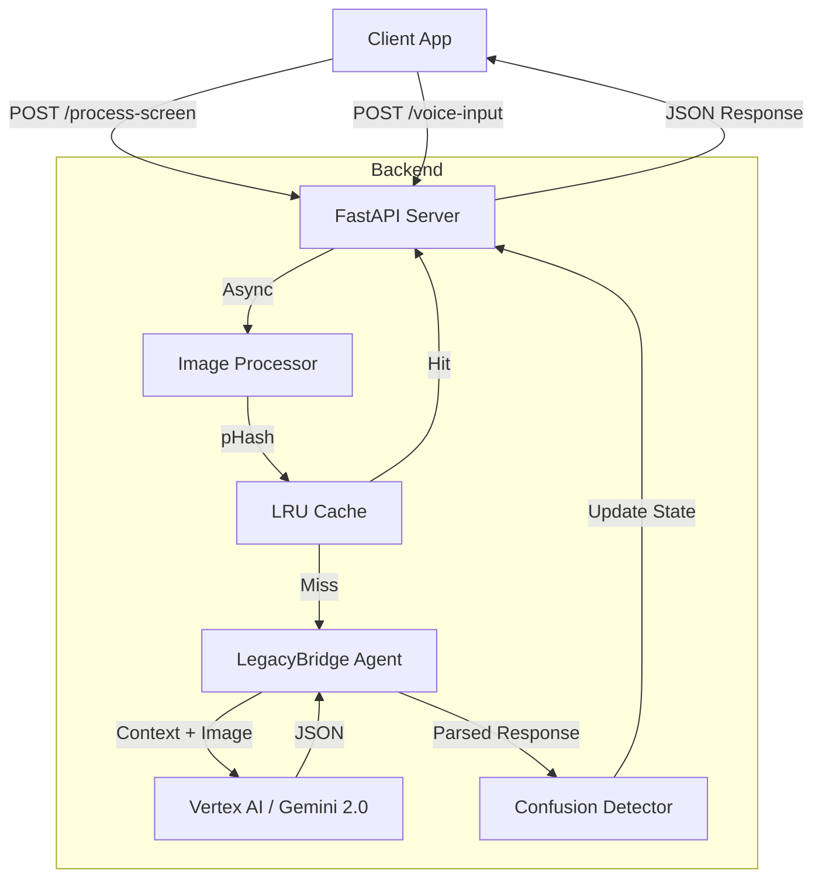

# LegacyBridge Backend Documentation

## 📚 Overview

The LegacyBridge Backend is a high-performance, asynchronous FastAPI application designed to power **Aria**, an AI assistant for elderly users. It serves as the "brain" of the operation, processing visual and auditory inputs from the client, analyzing them using Google's **Gemini 2.0 Flash** model, and returning actionable, empathetic guidance.

Key features:
- **Multimodal Analysis:** Processes both screen screenshots (Vision) and user voice commands (Audio/Text).
- **Optimized Latency:** Implements perceptual hashing (pHash) and LRU caching to skip redundant AI calls, achieving sub-100ms responses for static screens.
- **Confusion Detection:** sophisticated heuristic engine that tracks user behavior (clicks, mouse movement, screen stagnation) to detect frustration.
- **Bidirectional Voice:** Context-aware voice interaction allowing users to ask questions about what is on their screen.
- **Production Ready:** Includes Docker support, warm-up logic, auto-retries, and comprehensive error handling.

---

## 🏗️ Architecture

The backend follows a stateless, event-driven architecture optimized for the **Observer Pattern**.



### Tech Stack
- **Framework:** FastAPI (Python 3.11)
- **AI Model:** Google Gemini 2.0 Flash (via Vertex AI SDK)
- **Image Processing:** Pillow (PIL) + ThreadPoolExecutor
- **Server:** Uvicorn (ASGI)
- **Deployment:** Docker / Google Cloud Run

---

## 🚀 Setup & Installation

### Prerequisites
- Python 3.11+
- Google Cloud Project with Vertex AI API enabled.
- Service Account credentials (JSON) or local `gcloud auth application-default login`.

### Environment Variables
Create a `.env` file in the project root (or `server/`):

```ini
GOOGLE_CLOUD_PROJECT=your-project-id
GOOGLE_CLOUD_LOCATION=us-central1
CONFUSION_THRESHOLD=3
CONFUSION_TIME_WINDOW=30
```

### Local Development
1. **Navigate to server directory:**
   ```bash
   cd server
   ```
2. **Install dependencies:**
   ```bash
   pip install -r requirements.txt
   ```
3. **Run the server:**
   ```bash
   uvicorn app.main:app --reload --port 8000
   ```

### Docker Deployment
1. **Build image:**
   ```bash
   docker build -t legacybridge-backend .
   ```
2. **Run container:**
   ```bash
   docker run -p 8000:8000 --env-file .env legacybridge-backend
   ```

---

## 🔌 API Reference

### 1. Health Check
**GET** `/health`
Returns server status and performance metrics.
```json
{
  "status": "ok",
  "stats": {
    "total_requests": 150,
    "cache_hit_rate_pct": 45.2,
    "avg_response_ms": 320.5
  }
}
```

### 2. Process Screen (Core Loop)
**POST** `/process-screen`
Main endpoint called by the client every N seconds.
- **Body:** `multipart/form-data`
  - `file`: Screenshot image (JPEG/PNG)
  - `movement`: (Optional) JSON string of mouse movement history
- **Response:**
```json
{
  "status": "success",
  "data": {
    "guidance": "Tap the green phone icon to answer.",
    "urgency": "MEDIUM",
    "poll_interval_hint": 2,
    "visual_target": "[800, 450]",
    "screen_description": "Incoming call screen with answer button."
  },
  "confusion": { "is_confused": false, "score": 0.1 },
  "cache_hit": false
}
```

### 3. Voice Input (Bidirectional)
**POST** `/voice-input`
Handles user voice commands with visual context.
- **Body:** JSON
  ```json
  { "text": "What is this button?" }
  ```
- **Logic:** Uses the *last processed screen* (`_last_image_bytes`) to answer the question.
- **Response:** Standard Aria guidance JSON.

### 4. Report Click
**POST** `/report-click`
Fire-and-forget endpoint to log user clicks for confusion analysis.
- **Body:** `{ "x": 500, "y": 300 }`

---

## 🧠 Core Logic Modules

### 1. Image Processing & Caching (`image_utils.py`, `main.py`)
To reduce latency and cost, we don't send every frame to Gemini.
- **Perceptual Hashing (pHash):** We compute a 64-bit fingerprint of the incoming screenshot.
- **Similarity Check:** If the current hash is within a Hamming distance of 3 from the previous frame, we consider the screen "unchanged."
- **LRU Cache:** If the screen is unchanged and the user is **not** confused, we return the cached response immediately (0ms latency).
- **Async Execution:** Image resizing and hashing run in a `ThreadPoolExecutor` to avoid blocking the async event loop.

### 2. Confusion Detection (`confusion_detector.py`)
A weighted scoring system determines if the user is struggling.
- **Inputs:**
  - **Vision Urgency (40%):** Gemini flags the screen as "Error" or "Stuck".
  - **Screen Stagnation (25%):** Screen hasn't changed for multiple cycles.
  - **Mouse Drift (20%):** Erratic mouse movement without clicking (searching).
  - **Inactivity (10%):** User hasn't moved the mouse for 15s.
  - **Rapid Clicks (5%):** Panic clicking (5+ clicks in 3s).
- **Output:** Score (0.0 - 1.0). If `score >= 0.20`, a **Prompt Modifier** is injected into the next Gemini call to change Aria's persona (more patient, more descriptive).

### 3. AI Optimization (`ai_optimizer.py`)
Ensures reliability and speed.
- **Warm-up:** Fires a dummy request on server startup to load the model into GPU memory.
- **Auto-Retry:** If Gemini returns invalid JSON, we automatically retry once with a simplified, strict prompt.
- **Sanitizer:** Trims response text to a maximum word count to ensure short, easy-to-read guidance.

### 4. Agent Wrapper (`adk_wrapper.py`)
Encapsulates the Gemini interaction, ostensibly following the Google Agent Development Kit (ADK) patterns. It prepares the multimodal request (Image + System Prompt + Context) and manages the response parsing.

---

## 📂 Project Structure (Server)

```
server/
├── Dockerfile              # Container definition
├── requirements.txt        # Python dependencies
└── app/
    ├── main.py             # FastAPI entry point & endpoints
    ├── adk_wrapper.py      # Gemini / Vertex AI interface
    ├── ai_optimizer.py     # Retry logic, warm-up, sanitation
    ├── confusion_detector.py # User behavior analysis logic
    └── image_utils.py      # pHash, resizing, compression
```
