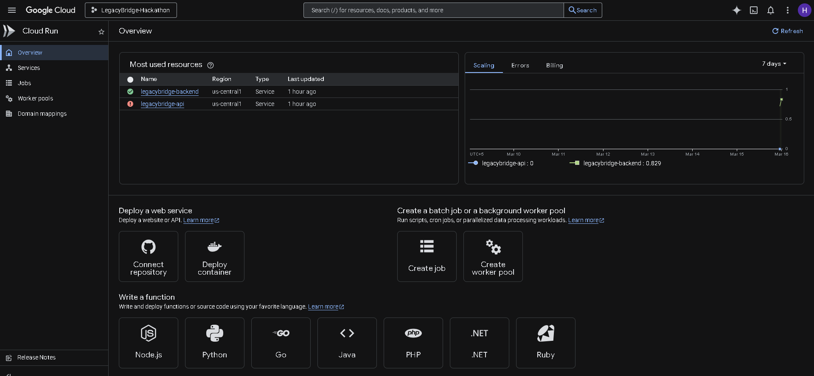
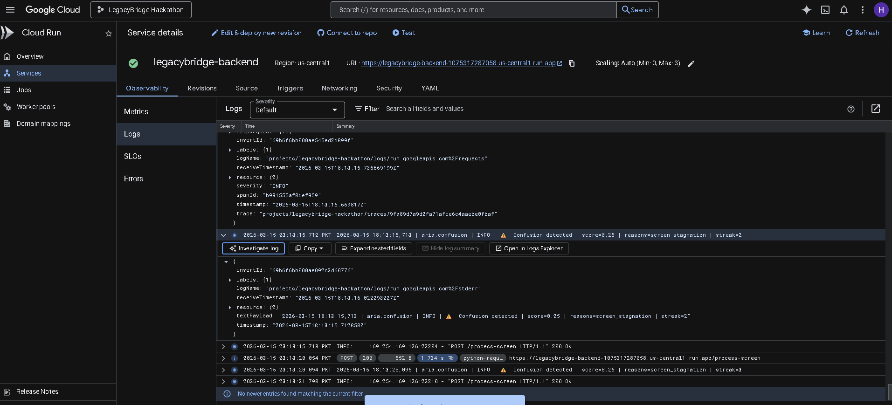

# Proof of Google Cloud Deployment

This folder contains the required proof of Google Cloud deployment for our submission to the Gemini Live Agent Challenge.

## 1. Live Backend Hosting URL

The LegacyBridge backend is currently live and hosted on Google Cloud Run. This backend powers the entire visual reasoning loop for Aria.

**Live API URL:** `https://legacybridge-backend-1075317287058.us-central1.run.app`

## 2. Proof of GCP Services (Code Links)

As per the Devpost requirements to demonstrate the use of Google Cloud services and APIs, the following files in our repository serve as direct code proof:

* **Vertex AI (Gemini 2.0 Flash) Integration:**
  [server/app/main.py](https://github.com/ayesha-aniqa/LegacyBridge-Hackathon/blob/main/server/app/main.py)
  *(This file initializes the `vertexai` client and makes direct API calls to the Google Cloud Vertex AI endpoint to analyze the screenshots).*
* **Infrastructure as Code (Cloud Run Deployment):**
  [infra/main.tf](https://github.com/ayesha-aniqa/LegacyBridge-Hackathon/blob/main/infra/main.tf)
  *(This Terraform script demonstrates our use of IaC to explicitly configure and deploy our serverless architecture to Google Cloud Run, aiming for the deployment bonus points).*

## 3. GCP Console Screenshots

*(Below are screenshots of the Google Cloud Console showing our active deployment and deployed resources:)*

*(Below are screenshots of the Google Cloud Console showing our active deployment and deployed resources:)*

---
*Note: This information is provided to fulfill the "URL to Proof of Google Cloud deployment" and "Project Link" criteria for the Devpost submission.*
